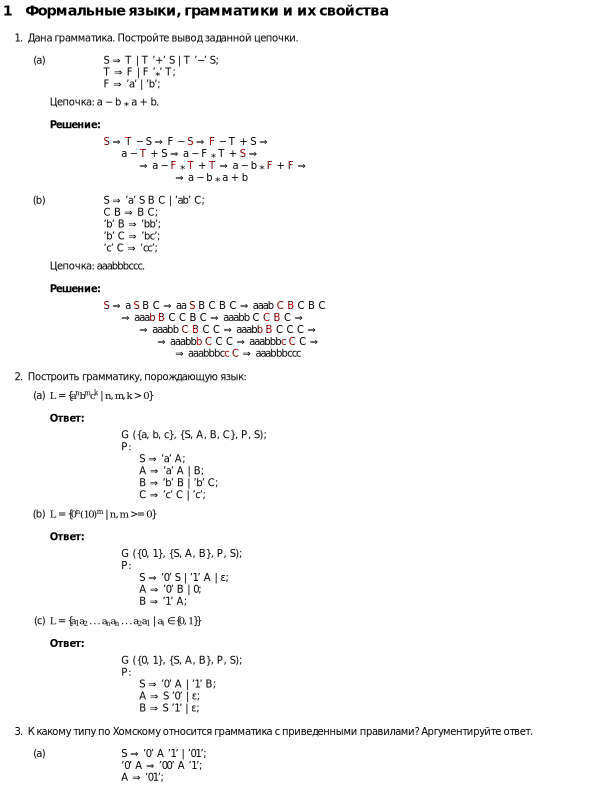
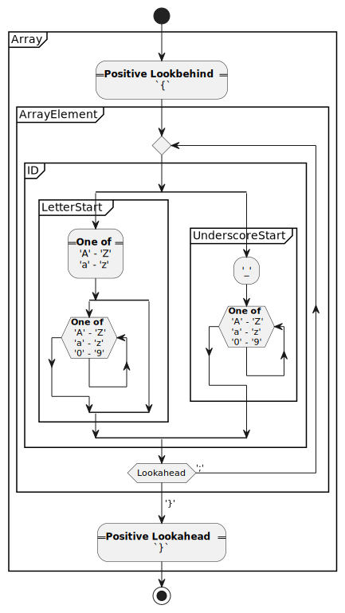
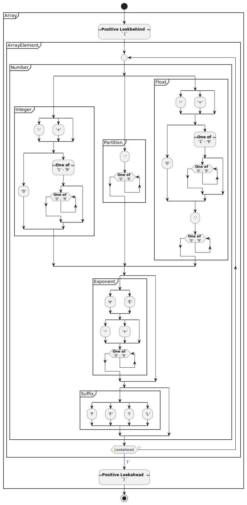

= Теория языков программирования и методы трансляции =

Ковалев Максим Игоревич, гр. ИВ-923.

6. Напишите регулярное выражение для:
  - Множества идентификаторов, где идентификатор – это последовательность букв или цифр, начинающаяся с буквы или `_`. **Решение**:
    - `(?<={)((([A-Za-z][A-Za-z0-9]*)|(_[A-Za-z0-9]+))((?=})|;))+(?=})`
    -
      * `{Imposter420}` ⇒ `Imposter420`
      * `{_420ImPoster}` ⇒ `_420ImPoster`
      * `{__imposter}` ⇒ `ε`
      * `{420ImPoster}` ⇒ `ε`
      * `{Impo$ter}` ⇒ `ε`
      * `{Imposter420;_420ImPoster;coolGuy}` ⇒ `Imposter420;_420ImPoster;coolGuy`
      * `{_420ImPoster;__imp@sSt3r}` ⇒ `ε`
      * `{_}` ⇒ `ε`
      * `Imposter420` ⇒ `ε`
    - [RegExr](https://regexr.com/6guc4)
  - Множества вещественных констант с плавающей точкой, состоящих из целой части, десятичной точки, дробной части, символа `е` или `Е`, целого показателя степени с необязательным знаком и необязательного суффикса типа – одной из букв `f`, `F`, `l` или `L`. Целая и дробная части состоят из последовательностей цифр. Может отсутствовать либо целая, либо дробная часть (но не обе сразу). **Решение**:
    - `(?<={)((((-|\+)?(0|[1-9][0-9]*)|\.[0-9]+|(-|\+)?(0|[1-9][0-9]*)\.[0-9]+)((e|E)(-|\+)?[0-9]+)?(f|F|l|L)?)((?=})|;))+(?=})`
    - 
      * `{5;7;-8}` ⇒ `5;7;-8`
      * `{0}` ⇒ `0`
      * `0` ⇒ `ε`
      * `{-25.6;.01;2}` ⇒ `-25.6;.01;2ε`
      * `{6;TheLetter;32}` ⇒ `ε`
      * `{6e+2;4.6E-1;-3.1e0}` ⇒ `6e+2;4.6E-1;-3.1e0`
      * `{6e}` ⇒ `ε`
      * `{4e+}` ⇒ `ε`
      * `{-.5}` ⇒ `ε`
      * `{5L;-32l;24.55f;-21F}` ⇒ `5L;-32l;24.55f;-21F`
      * `{-0.216e+6F}` ⇒ `-0.216e+6F`
      * `{4e+5.4}` ⇒ `ε`
    - [RegExr](https://regexr.com/6gudb)

7. Для регулярных выражений из предыдущего задания постройте конечные автоматы. Изобразите их в виде графа.

